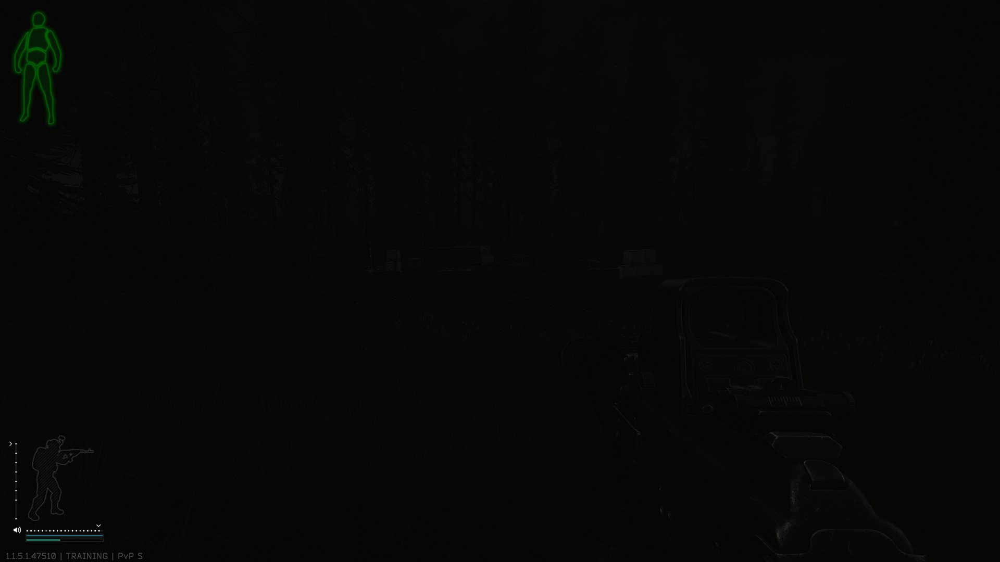
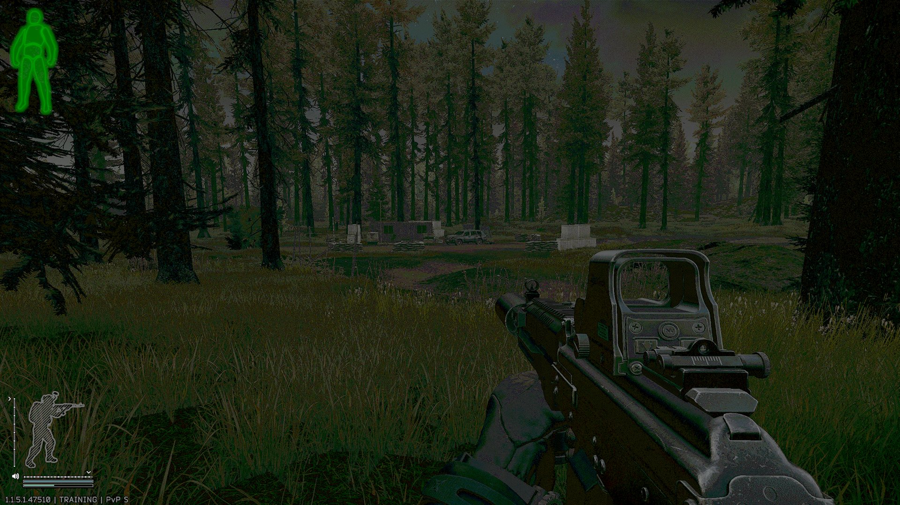

  

<h1 align="center">Gampi – Gamma Presets Instant</h1>

  See more. Richer colors. Automatically per game. 
  Free · Windows 10/11 (64-bit) · AMD &amp; NVIDIA

  <a href="https://github.com/Wussatier/gampi/releases/latest/download/Gampi-Setup.exe"><b>Download installer</b></a>
  &nbsp;·&nbsp;
  <a href="https://github.com/Wussatier/gampi/releases/latest/download/Gampi-portable.exe"><b>Portable version</b></a>
  &nbsp;·&nbsp;
  <a href="https://github.com/Wussatier/gampi/releases">All releases</a>
  &nbsp;·&nbsp;
  <a href="https://wussatier.github.io/gampi/">Website</a>

| Before | With Gampi (preset “Night Ops”) |
|---|---|
|  |  |

> [!TIP]
> **Not just for games.** Gampi works on everything your monitor shows –
> movies, streams, the browser or your work apps.

[Deutsche Version weiter unten](#deutsch)

## Why Gampi exists

Sound familiar? A game is so dark you can barely make anything out – you
simply don't see the enemy in the corner. Or it's so pale it looks flat, as if
behind a grey veil. And the usual fixes don't make it any better:

- **The sliders barely help.** Turn up the brightness in the game or on the
  monitor and the whole picture gets lighter: black turns grey, bright spots
  blow out. Sliders for contrast or color are often missing entirely.
- **Scattered everywhere – and applies to everything.** Gamma in the driver,
  contrast in the monitor menu, color profiles in Windows color management.
  And every change applies to the whole PC – after every game you switch
  everything back by hand.

## What Gampi does

Gampi tunes your monitor's gamma, contrast, brightness and colors for every
game – all in one app. You spot enemies in the shadows without the picture
turning grey, and pale games get their color back. Start the game and your
preset switches on by itself – afterwards everything is back to normal.

- **No FPS loss, no latency** – your graphics card applies the setting right at
  display output. No overlay, no filter processing every frame.
- **Automatic per game** – launch the game and your preset is active; quit it
  and your desktop looks normal again.
- **Switch by hotkey** – day, night, indoors: one key press mid-game.
- **Shadow boost** – brightens only the darkest tones, the rest of the picture
  stays as it is.
- **Gamma for AMD, at last** – AMD Software has no gamma slider, Gampi does.
  Saturation goes through your AMD or NVIDIA driver, in the same preset.
- **ICC profiles** – attach your own color profile to each preset for the final
  polish.
- **Stays as you set it** – if fullscreen switches or a monitor waking up reset
  the picture, Gampi restores your preset right away.
- **Neatly organized** – one folder per game with as many presets as you like.
- **Instant feedback** – a live curve shows whether a setting really reveals
  more; templates (Night Ops, Clarity, Vivid) and suggestions from a
  screenshot give you a starting point.
- **Share presets** – as a file, imported by drag &amp; drop. Before/after
  images and a LUT for OBS make the effect visible in screenshots and videos.
- **German and English** interface.

## Getting started

1. Download the installer or the portable version (a single file, no
   installation) and start Gampi.
2. Add your game: enter a name and pick the EXE, or choose it from the running
   programs.
3. Tune a preset: start from a template or move the sliders until you like it.
4. Play – Gampi handles the rest.

Windows may show “Windows protected your PC” on first start, because Gampi is
new and not widely used yet. Click “More info” → “Run anyway”.

## Good to know

- Gampi only uses functions of Windows and your graphics driver. It runs no
  code inside games, reads no game memory and draws no overlay.
- Settings apply to the primary display.
- Saturation needs an AMD or NVIDIA card; everything else works with any
  graphics card.
- While HDR is on, Windows ignores the gamma curve; saturation still works.
- When you quit Gampi, sign out or start it again, everything is reset to
  default.
- No account, no ads, no data collection – Gampi runs entirely locally.

## License

Gampi is freeware: free to use, privately and professionally. The program
files may be passed on unmodified and free of charge. Details in
[LICENSE.txt](LICENSE.txt). The source code is not part of this repository;
it holds the website and the releases.

Names of games, graphics card and software manufacturers are trademarks of
their respective owners. Gampi is not affiliated with them.

---

<h2 id="deutsch">Deutsch</h2>

Mehr sehen. Kräftigere Farben. Automatisch pro Spiel.
Kostenlos · Windows 10/11 (64 Bit) · AMD &amp; NVIDIA

[Installer herunterladen](https://github.com/Wussatier/gampi/releases/latest/download/Gampi-Setup.exe) ·
[Portable Version](https://github.com/Wussatier/gampi/releases/latest/download/Gampi-portable.exe) ·
[Alle Versionen](https://github.com/Wussatier/gampi/releases) ·
[Website](https://wussatier.github.io/gampi/)

> [!TIP]
> **Nicht nur für Spiele.** Gampi wirkt auf alles, was dein Monitor zeigt –
> Filme, Streams, den Browser oder deine Arbeitsprogramme.

### Warum es Gampi gibt

Kennst du das? Ein Spiel ist so dunkel, dass du kaum etwas erkennst – den
Gegner in der Ecke siehst du einfach nicht. Oder es ist so blass, dass es flau
aussieht, wie hinter einem Grauschleier. Und die üblichen Lösungen machen es
nicht besser:

- **Die Regler helfen kaum.** Drehst du im Spiel oder am Monitor die
  Helligkeit hoch, wird das ganze Bild heller: Schwarz wird grau, helle Stellen
  brennen aus. Regler für Kontrast oder Farbe fehlen oft ganz.
- **Überall verstreut – und gilt für alles.** Gamma im Treiber, Kontrast im
  Monitor-Menü, Farbprofile in der Windows-Farbverwaltung. Und jede Änderung
  gilt für den ganzen PC – nach jedem Spiel stellst du alles von Hand zurück.

### Was Gampi macht

Gampi stellt Gamma, Kontrast, Helligkeit und Farben deines Monitors für jedes
Spiel passend ein – alles in einer Anwendung. Du erkennst Gegner im Schatten,
ohne dass das Bild grau wird, und blasse Spiele bekommen wieder Farbe. Startest
du das Spiel, schaltet sich dein Preset von selbst ein – danach ist alles
wieder normal.

- **Kein FPS-Verlust, keine Latenz** – deine Grafikkarte wendet die Einstellung
  direkt bei der Bildausgabe an. Kein Overlay, kein Filter, der jedes Bild
  nachbearbeitet.
- **Automatisch pro Spiel** – startest du das Spiel, ist dein Preset aktiv;
  beendest du es, sieht dein Desktop wieder normal aus.
- **Wechsel per Hotkey** – Tag, Nacht, Innenraum: ein Tastendruck mitten im
  Spiel.
- **Schatten-Boost** – hellt nur die dunkelsten Töne auf, der Rest des Bildes
  bleibt, wie er ist.
- **Endlich Gamma für AMD** – AMD Software hat keinen Gamma-Regler, Gampi
  schon. Die Sättigung regelt Gampi über deinen AMD- oder NVIDIA-Treiber, im
  selben Preset.
- **ICC-Profile** – hinterlege pro Preset ein eigenes Farbprofil für den
  letzten Feinschliff.
- **Bleibt, wie eingestellt** – setzen Vollbild-Wechsel oder ein aufwachender
  Monitor das Bild zurück, stellt Gampi dein Preset sofort wieder her.
- **Übersichtlich sortiert** – pro Spiel ein Ordner mit beliebig vielen Presets.
- **Direktes Feedback** – eine Live-Kurve zeigt, ob eine Einstellung wirklich
  mehr zeigt; Vorlagen (Night Ops, Clarity, Vivid) und Vorschläge aus einem
  Screenshot geben dir einen Startpunkt.
- **Presets teilen** – als Datei, importiert per Drag &amp; Drop.
  Vorher/Nachher-Bilder und eine LUT für OBS machen den Effekt auch in
  Screenshots und Videos sichtbar.
- Oberfläche auf **Deutsch und Englisch**.

### Loslegen

1. Installer oder portable Version (eine einzelne Datei, ohne Installation)
   herunterladen und Gampi starten.
2. Spiel anlegen: Namen eingeben und die EXE wählen – oder das Spiel aus den
   laufenden Programmen auswählen.
3. Preset einstellen: mit einer Vorlage starten oder die Regler verschieben,
   bis es dir gefällt.
4. Spielen – den Rest erledigt Gampi.

Windows zeigt beim ersten Start eventuell „Der Computer wurde durch Windows
geschützt“, weil Gampi neu und noch wenig verbreitet ist. Über „Weitere
Informationen“ → „Trotzdem ausführen“ startet es.

### Gut zu wissen

- Gampi nutzt nur Funktionen von Windows und deinem Grafiktreiber. Es läuft
  kein Code im Spiel, es wird kein Spielspeicher gelesen und kein Overlay
  gezeichnet.
- Die Einstellungen wirken auf den Hauptbildschirm.
- Für die Sättigung brauchst du eine AMD- oder NVIDIA-Karte; alles andere
  funktioniert mit jeder Grafikkarte.
- Unter HDR ignoriert Windows die Gamma-Kurve; die Sättigung funktioniert
  weiterhin.
- Beim Beenden, beim Abmelden und beim nächsten Start setzt Gampi alles auf
  Standard zurück.
- Kein Konto, keine Werbung, keine Datensammlung – Gampi läuft komplett lokal.

### Lizenz

Gampi ist Freeware: kostenlos nutzbar, privat wie beruflich. Die
Programmdateien dürfen unverändert und kostenlos weitergegeben werden. Details
in [LICENSE.txt](LICENSE.txt). Der Quellcode ist nicht Teil dieses
Repositorys; es enthält die Website und die Releases.

Genannte Namen von Spielen, Grafikkarten- und Softwareherstellern sind Marken
ihrer jeweiligen Inhaber. Gampi steht in keiner Verbindung zu ihnen.

---

Made by **Wussa**
